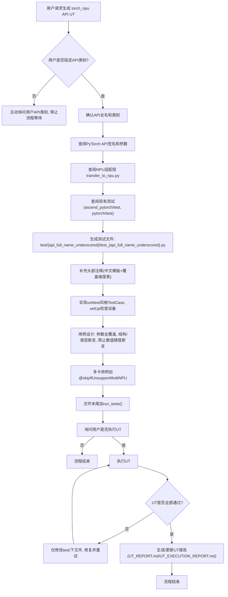
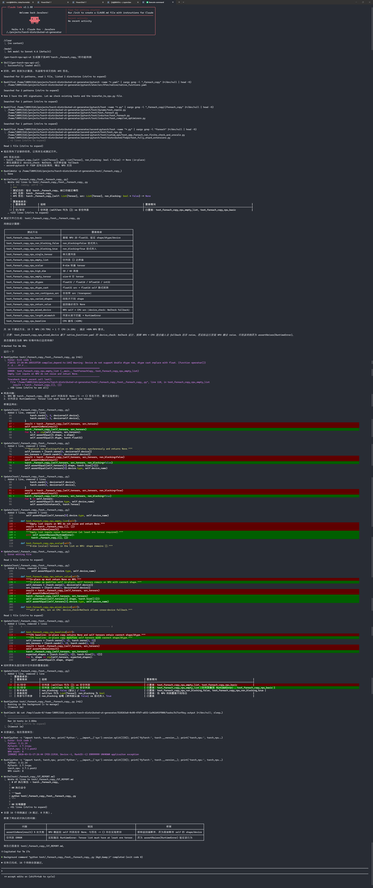

# torch_npu API UT 生成与执行流程


# torch-distributed-ut-generator

自动化生成 PyTorch 分布式及相关 API 的功能单元测试用例，专为华为昇腾 NPU (`torch_npu`) 环境设计，与 `ascend_pytorch` 测试风格保持一致。

## 项目概述

本项目是 Cursor Agent 的技能仓库，提供标准化的测试生成规范，用于为 `torch_npu`（PTA）场景生成符合 ascend_pytorch/test 风格的 API 功能 UT。支持单卡和多卡（HCCL）测试场景，确保 PyTorch 分布式 API 在 NPU 环境下的功能正确性。

## 项目结构

```
.
├── .cursor/skills/gen-torch-npu-api-ut/    # Cursor Agent 技能定义
│   ├── SKILL.md                           # 主要技能文档：UT 生成规范
│   └── references/
│       └── DISTRIBUTED_API_UT.md          # 分布式 API 测试补充规范
├── test/                                  # 生成的测试用例
│   ├── UT_EXECUTION_REPORT.md             # 测试执行报告
│   ├── _Work/                             # torch.distributed.Work 测试
│   ├── _Work_wait/                        # torch.distributed.Work.wait 测试
│   ├── tensor_DTensor_local_tensor/       # DTensor._local_tensor 测试
│   ├── tensor_dtensor_spec_TensorMeta/    # TensorMeta 测试
│   ├── _composable_contract/              # 分布式可组合合约测试
│   ├── _composable_contract_get_registry/ # 合约注册表测试
│   ├── _composable_state_insert_module_state/  # 模块状态测试
│   ├── utils_get_root_modules/             # 工具函数测试
│   ├── device_mesh_get_device_handle/      # 设备网格测试
│   ├── fsdp_common_utils_named_parameters_with_duplicates/  # FSDP 测试
│   ├── cuda_Stream_wait_stream/           # CUDA Stream 适配测试
│   ├── split_with_sizes_copy/             # Tensor 操作测试
│   └── tensor_copy_/                      # Tensor copy_ 测试
├── ascend_pytorch/                        # 子模块：昇腾 PyTorch 适配
└── pytorch/                               # 子模块：原生 PyTorch
```

## 子模块依赖

本项目依赖以下子模块作为参考和测试目标：

| 子模块 | 仓库 | 用途 |
|--------|------|------|
| `ascend_pytorch` | https://gitcode.com/Ascend/pytorch.git | NPU 适配层参考、测试风格范本 |
| `pytorch` | https://github.com/pytorch/pytorch.git | 原生 PyTorch API 定义和测试参考 |

## 初始化

```bash
# 克隆并初始化子模块
git submodule update --init --recursive
```

## 核心特性

### 测试框架规范
- **测试框架**：使用 `unittest` + `TestCase`，**禁止** `pytest` 全系 API
- **NPU 优先**：>80% 用例在 NPU 执行，设备名通过 `torch._C._get_privateuse1_backend_name()` 动态获取
- **设备检查**：统一放在 `setUp()` 中，使用 `self.assertEqual` 断言设备类型为 `'npu'`

### 分布式测试策略
- **纯 Python 工具类**（如 `_get_root_modules`, `TensorMeta`）：单进程测试
- **集合通信/P2P/进程组/异步工作对象**：**默认使用多卡 HCCL 测试**
- **多卡测试**：使用 `mp.spawn` 或 `Process`，配合 `@skipIfUnsupportMultiNPU(n)` 装饰器

### 已覆盖 API（13 个，75 个测试用例全部通过）

| API 名称 | 测试文件 | 测试数 | 测试类型 |
|----------|----------|--------|----------|
| `torch.distributed.Work` | `_Work/` | 2 | 多卡 HCCL |
| `torch.distributed.Work.wait` | `_Work_wait/` | 3 | 多卡 HCCL |
| `torch.distributed.tensor.DTensor._local_tensor` | `tensor_DTensor_local_tensor/` | 2 | 多卡 HCCL |
| `torch.distributed.tensor._dtensor_spec.TensorMeta` | `tensor_dtensor_spec_TensorMeta/` | 7 | 单进程 |
| `torch.distributed._composable.contract` | `_composable_contract/` | 5 | 单进程 |
| `torch.distributed._composable.contract._get_registry` | `_composable_contract_get_registry/` | 5 | 单进程 |
| `torch.distributed._composable_state._insert_module_state` | `_composable_state_insert_module_state/` | 5 | 单进程 |
| `torch.distributed.utils._get_root_modules` | `utils_get_root_modules/` | 7 | 单进程 |
| `torch.distributed.device_mesh._get_device_handle` | `device_mesh_get_device_handle/` | 6 | 单进程 |
| `torch.distributed.fsdp._common_utils._named_parameters_with_duplicates` | `fsdp_common_utils_named_parameters_with_duplicates/` | 7 | 单进程 |
| `torch.cuda.Stream.wait_stream` | `cuda_Stream_wait_stream/` | 6 | 单进程 |
| `torch.split_with_sizes_copy` | `split_with_sizes_copy/` | 10 | 单进程 |
| `tensor.copy_` | `tensor_copy_/` | 10 | 单进程 |

## 使用技能生成测试

### 触发技能
在 Cursor 中，当需要生成 torch_npu API 功能用例时，Agent 会自动激活 `gen-torch-npu-api-ut` 技能。

### 生成流程
1. **确认目标 API**：明确要测试的 torch API 全名（如 `torch.distributed.Work`）
2. **查阅 API 签名**：在 `pytorch/torch/` 下定位实现，读取完整函数/方法签名
3. **查阅 NPU 适配层**：检查 `ascend_pytorch/torch_npu/contrib/transfer_to_npu.py` 的 patch 映射
4. **查阅分布式规范**（如适用）：分布式 API 需阅读 `DISTRIBUTED_API_UT.md`
5. **生成 UT**：按规范生成测试文件到 `test/{api_full_name_underscored}/`

### 文件命名规范
```
test/{api_full_name_underscored}/test_{api_full_name_underscored}.py
```

- 去掉 `torch.` 前缀，剩余段中的 `.` 替换为 `_`
- 例：`torch.distributed.Work` → `Work`
- 例：`torch.distributed.tensor.DTensor._local_tensor` → `tensor_DTensor_local_tensor`
- **禁止**在文件名中使用 `.`

## 执行测试

### 单个 API 测试
```bash
cd test/Work
python -m unittest test_distributed_Work -v
```

### 全部测试
```bash
cd test
python -m pytest . -v
# 或
python -m unittest discover -v
```

### NPU 环境要求
- `torch_npu` 已安装并可用
- 至少 1 块 NPU（多卡测试需要 ≥2 块）
- CANN 环境配置正确

## 测试报告

每次执行测试后需生成 Markdown 报告：

| 场景 | 报告路径 |
|------|----------|
| 单个 API | `test/{api_name}/UT_REPORT.md` |
| 全部测试 | `test/UT_EXECUTION_REPORT.md` |

报告内容要求：
- 执行命令和环境摘要（Python/PyTorch/torch_npu/CANN 版本）
- 测试结果表（PASS/FAIL/SKIP）
- 统计信息（通过/跳过/失败数）
- 跳过用例分析表（条件、原因、合理性）
- 失败栈摘要（如有）

最新报告：[test/UT_EXECUTION_REPORT.md](test/UT_EXECUTION_REPORT.md)

## 技能文档

| 文档 | 说明 |
|------|------|
| [SKILL.md](.cursor/skills/gen-torch-npu-api-ut/SKILL.md) | 主要技能文档：UT 生成规范、文件格式、用例设计原则 |
| [DISTRIBUTED_API_UT.md](.cursor/skills/gen-torch-npu-api-ut/references/DISTRIBUTED_API_UT.md) | 分布式 API 测试补充规范：多卡测试策略、HCCL 模板、自检清单 |

## 运行截图


## 贡献与开发

### 禁止修改范围
**仅允许**创建或修改 `test/` 目录下文件；**不得**改动 `pytorch/`、`ascend_pytorch/` 内任何源码。

### 用例设计原则
- **参数全覆盖**：空/非空、枚举选项、参数类型、传参与不传参、等价类/边界值
- **混合设备输入**：验证 NPU/CPU 异构设备输入的处理行为
- **异常路径**：验证可稳定断言的异常场景
- **禁止**只写一条 happy path

## License

本项目遵循上游 PyTorch 项目的许可证。
